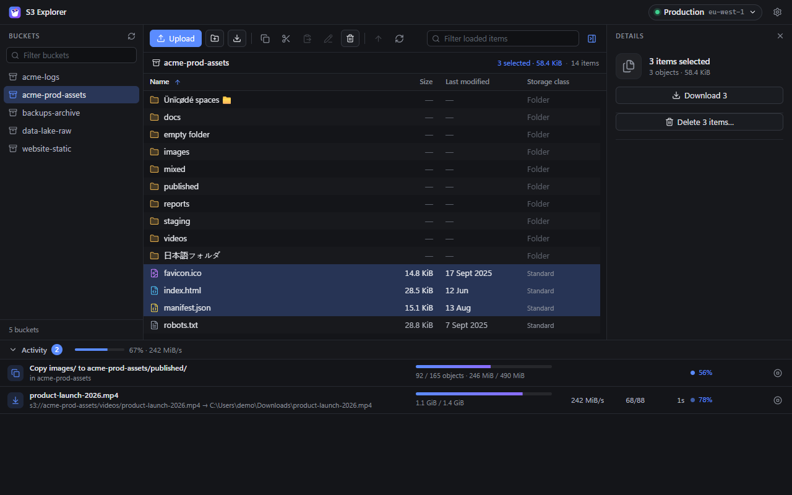
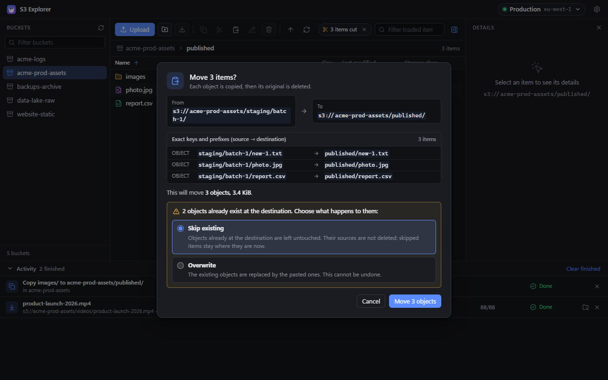
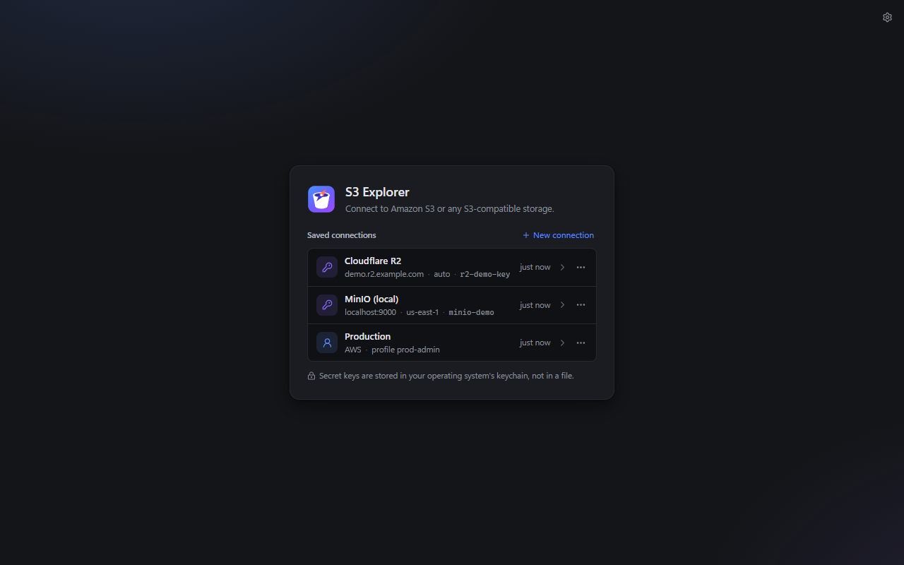
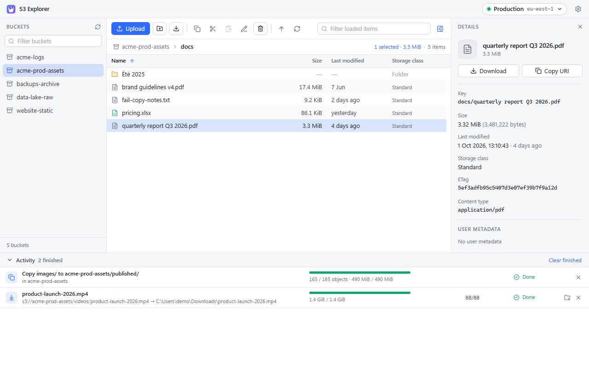

<p align="center"></p>

# S3 Explorer

A fast desktop file manager for Amazon S3 and S3-compatible storage. One small native executable, no Electron, no subscription.



## Why this exists

I didn't want to pay for an S3 explorer tool. So I vibe coded one. :)

**This project is vibe coded.** I described what I wanted and AI agents wrote essentially all of it: the Rust backend, the React UI, the tests, the build pipeline, and yes, most of this README. I steered, reviewed the results and said "also add that". If that makes you nervous about pointing it at a production bucket, good. Read [Should you trust it?](#should-you-trust-it) before you do.

## What it does

- **Connect** with an AWS profile from `~/.aws`, or with access keys. A custom endpoint makes it work with MinIO, Cloudflare R2, SeaweedFS, LocalStack and friends.
- **List buckets**, including buckets in other regions.
- **Browse folders and objects** in a virtualized table that stays smooth with thousands of rows. Size, last modified, storage class, ETag, content type and user metadata are all there.
- **Download in parallel parts.** Large objects are split into byte ranges and fetched over several connections at once.
- **Upload** with multipart for large files, by button or by dragging files onto the window.
- **Delete, rename, copy and move** objects and folders, within a bucket or between buckets, from the right-click menu, the toolbar or the keyboard (`Delete`, `F2`, `Ctrl+C`, `Ctrl+X`, `Ctrl+V`). Every delete, move or overwrite shows you the exact keys and how much is affected before it happens.
- **Create folders.**
- **Activity panel** for transfers and file operations: live speed, parts, time remaining, cancel, a list of anything that failed, and "show in folder".
- **Saved connections.** Keep an AWS profile or access keys under a name and connect with one click. Secret keys live in your operating system's keychain, never in a file.
- **Settings** for part size, parallel parts per transfer and simultaneous transfers, with a live estimate of connections and memory before you save.
- **Light, dark or system theme.**
- **Updates from inside the app.** Check for a new version, read its patch notes, install it. Only updates signed by this project are installed.



| | |
|---|---|
|  |  |

### What it does not do (yet)

Creating or deleting buckets, browsing or restoring old versions, restoring archived objects, presigned URLs, permissions, sync, and uploading or downloading whole folders. It is scoped small on purpose.

## How move, rename and delete stay safe

S3 has no move or rename. The app copies, then deletes the original, and it is careful about the order:

- An original is deleted only after its own copy is confirmed, and not if the original changed in the meantime.
- A delete is counted only when the server confirms it.
- A cancelled or failed move leaves every object in exactly one place.
- A request that would write into its own source, such as moving a folder into itself, is refused.
- Nothing is overwritten unless you choose Overwrite. The default is to skip what already exists.
- Keys are never altered. Spaces, unicode and unusual characters are sent exactly as they are.
- What the confirmation shows is exactly what is sent, and items hidden by the filter are never included.

## How downloads are split

With the default settings:

| Object size | Part size | How it downloads |
|---|---|---|
| 8 MiB or less | not split | one ordinary GET |
| over 8 MiB, up to 1 GiB | 8 MiB | parallel ranged GETs |
| over 1 GiB | 16 MiB | parallel ranged GETs |

Up to 8 parts of a file are in flight at once, and up to 4 transfers run at the same time while the rest wait in a queue. Each part is written straight to its offset in a pre-sized temp file, which is renamed when the last part lands. Every request carries the object's ETag, so a file that changes mid-download fails instead of being stitched together from two versions. A part that fails resumes from where it stopped.

All three numbers are yours to change in Settings (the gear button): part size from 1 to 256 MiB, 1 to 32 parallel parts, and 1 to 10 simultaneous transfers. An object no larger than one part is fetched in a single request. Uploads always use parts of at least 5 MiB because S3 requires it. Parts larger than 16 MiB are streamed straight to disk, so a bigger part size does not cost more memory; more parallel parts do, and the dialog tells you roughly how much.

## Get it

**Download a build.** Every version is built for Windows, macOS (Apple Silicon and Intel) and Linux by GitHub Actions. Grab the file for your system from the [Releases page](../../releases): either the bare executable or an installer. Each release comes with patch notes. From v0.3.0 on, the app can also update itself from Settings.

**Or build it yourself.** You need [Node.js](https://nodejs.org) 22+, [Rust](https://rustup.rs) (the exact toolchain is pinned in `src-tauri/rust-toolchain.toml` and installs itself), and the [Tauri prerequisites](https://tauri.app/start/prerequisites/) for your OS.

```bash
git clone https://github.com/yonatand/S3Explorer.git
cd S3Explorer
npm install
npm run tauri build
```

The executable lands in `src-tauri/target/release/`, with installers under `src-tauri/target/release/bundle/`.

## IAM permissions

S3 Explorer only does what your credentials allow. It needs no permissions outside S3, never creates or changes IAM resources, and makes no calls to other AWS services. Grant only the rows you want to use:

| To do this | The app calls | You need |
|---|---|---|
| See the list of buckets | `ListBuckets` | `s3:ListAllMyBuckets` on `*` |
| Open a bucket and browse folders | `HeadBucket` (to find the bucket's region), `ListObjectsV2` | `s3:ListBucket` on the bucket |
| See object details, download | `HeadObject`, `GetObject` | `s3:GetObject` on the objects |
| Upload, create a folder | `PutObject`, `CreateMultipartUpload`, `UploadPart`, `CompleteMultipartUpload`, `AbortMultipartUpload` | `s3:PutObject` and `s3:AbortMultipartUpload` on the objects |
| Delete objects and folders | `ListObjectsV2`, `DeleteObjects` | `s3:ListBucket` on the bucket, `s3:DeleteObject` on the objects |
| Copy | `ListObjectsV2`, `HeadObject`, `CopyObject`; for objects over 5 GiB `CreateMultipartUpload`, `UploadPartCopy`, `CompleteMultipartUpload`, `GetObjectTagging` | `s3:ListBucket` and `s3:GetObject` on the source; `s3:ListBucket`, `s3:GetObject` and `s3:PutObject` on the destination (the app checks what already exists there and confirms each copy before a move deletes anything) |
| Move and rename | Copy, then delete the original | Everything for Copy, plus `s3:DeleteObject` on the source |

Two things that surprise people:

- **Without `s3:ListAllMyBuckets` the app still works.** It can't show the bucket list, so it asks you to type the bucket name instead.
- **Bucket-level and object-level permissions use different resources.** `s3:ListBucket` goes on `arn:aws:s3:::my-bucket`, while the object actions go on `arn:aws:s3:::my-bucket/*`. Mixing them up is the most common reason for "Access Denied".

### Full access to one bucket

Replace `my-bucket` with your bucket name. Add more buckets by adding their ARNs to both `Resource` lists.

```json
{
  "Version": "2012-10-17",
  "Statement": [
    {
      "Sid": "SeeBucketList",
      "Effect": "Allow",
      "Action": "s3:ListAllMyBuckets",
      "Resource": "*"
    },
    {
      "Sid": "BrowseBucket",
      "Effect": "Allow",
      "Action": "s3:ListBucket",
      "Resource": "arn:aws:s3:::my-bucket"
    },
    {
      "Sid": "ReadWriteDeleteObjects",
      "Effect": "Allow",
      "Action": [
        "s3:GetObject",
        "s3:PutObject",
        "s3:DeleteObject",
        "s3:AbortMultipartUpload",
        "s3:GetObjectTagging",
        "s3:PutObjectTagging"
      ],
      "Resource": "arn:aws:s3:::my-bucket/*"
    }
  ]
}
```

### Read-only

Browse and download, nothing else. Upload, new folder, delete, rename, copy and move will fail with "Access Denied", which is the point.

```json
{
  "Version": "2012-10-17",
  "Statement": [
    {
      "Effect": "Allow",
      "Action": "s3:ListAllMyBuckets",
      "Resource": "*"
    },
    {
      "Effect": "Allow",
      "Action": "s3:ListBucket",
      "Resource": "arn:aws:s3:::my-bucket"
    },
    {
      "Effect": "Allow",
      "Action": "s3:GetObject",
      "Resource": "arn:aws:s3:::my-bucket/*"
    }
  ]
}
```

### Depending on your setup

- **Tagged objects.** Copying keeps an object's tags, which needs `s3:GetObjectTagging` on the source and `s3:PutObjectTagging` on the destination. They are in the full policy above; you can drop them if you never copy or move tagged objects.
- **KMS-encrypted buckets (SSE-KMS).** Downloads need `kms:Decrypt` and uploads and copies need `kms:GenerateDataKey` on the bucket's KMS key. S3 calls KMS on your behalf; the app itself does not.
- **Versioned buckets.** Deleting adds a delete marker and older versions stay. The app never deletes specific versions, so it does not need `s3:DeleteObjectVersion`.
- **Archived objects (Glacier, Deep Archive).** They can be listed but not downloaded or copied until restored. The app does not restore objects.
- **Other S3-compatible storage** (MinIO, Cloudflare R2, SeaweedFS and others) has its own permission model. The table of calls above tells you what the app will ask the server to do.

The app remembers no more than it must: saved connections keep the secret key in your operating system's keychain, and an AWS profile is read from `~/.aws` each time you connect.

## Should you trust it?

Honest status, as of `v0.3.0`:

| | |
|---|---|
| Tested end to end on Windows against a local S3 server, including every delete, rename, copy and move path | yes |
| Destructive operations tested by comparing a full snapshot of the bucket before and after | yes |
| Unit tests, lint, and integration tests with checksum verification | yes |
| Independent AI code review of the delete, move and download code, with every finding fixed | yes |
| Builds and packages in CI for Windows, macOS and Linux | yes |
| Browsing and large downloads used against real AWS S3 by the author | yes |
| Delete, rename, copy and move tested against real AWS S3 | **not yet** |
| In-app update installed for real on any platform | **not yet** |
| macOS and Linux builds actually run by a human | **not yet** |
| Reviewed line by line by a human | **no** |

Some things were done carefully because this tool can delete data and write to your disk:

- Your secret key is never written to a file by the app. A saved connection keeps it in the operating system's keychain; everything else remembers only the name, region, endpoint and access key id.
- Deletes and moves send exactly the keys shown in the confirmation dialog, byte for byte. See [How move, rename and delete stay safe](#how-move-rename-and-delete-stay-safe).
- Updates are installed only if they carry this project's signature.
- File names coming from S3 are sanitized before they become local paths, so a hostile key can't write outside the folder you picked.
- The webview runs under a restrictive content security policy and all S3 traffic goes through the Rust side.

Still: it is young, AI-written software. Try it on a bucket you can afford to lose before trusting it with one you can't, and prefer credentials that only have the permissions you need.

## How it's built

- **[Tauri v2](https://tauri.app)** shell: the UI runs in the operating system's own webview, which is why the Windows executable is about 17 MB.
- **Rust** backend using the official AWS SDK and tokio. Transfers run entirely on this side.
- **React + TypeScript + Vite** frontend with a virtualized table.

The two halves talk through a small set of commands and a few progress events, all written down in [docs/CONTRACT.md](docs/CONTRACT.md).

### Developing

```bash
npm run dev          # UI only, in a browser, against a built-in mock (no Rust build needed)
npm run tauri dev    # the real desktop app with hot reload
```

```bash
cd src-tauri
cargo clippy --all-targets
cargo test
cargo run --example smoke   # transfers, end to end against a local S3-compatible server
cargo run --example jobs    # delete, copy and move, with before/after snapshots of the bucket
```

`npm run build` type-checks and bundles the frontend.

### How the vibe coding actually worked

One AI session acted as orchestrator. It picked the stack, wrote the contract between backend and frontend, then handed the two halves to separate agents that built them in parallel. A third agent drove the real executable end to end against a local S3 server, and a fourth did a read-only code review whose findings were fixed before the first tag. Every version since has gone the same way: contract first, halves in parallel, review, end-to-end run, then release.

The rules and playbooks the agents follow are checked in under [.claude/](.claude/), if you're curious what steering an AI-built project looks like in practice.

## Versioning

Releases are tagged `vMAJOR.MINOR.PATCH`. Pushing a tag builds the executables for all three platforms and publishes a release with the patch notes from [CHANGELOG.md](CHANGELOG.md).
