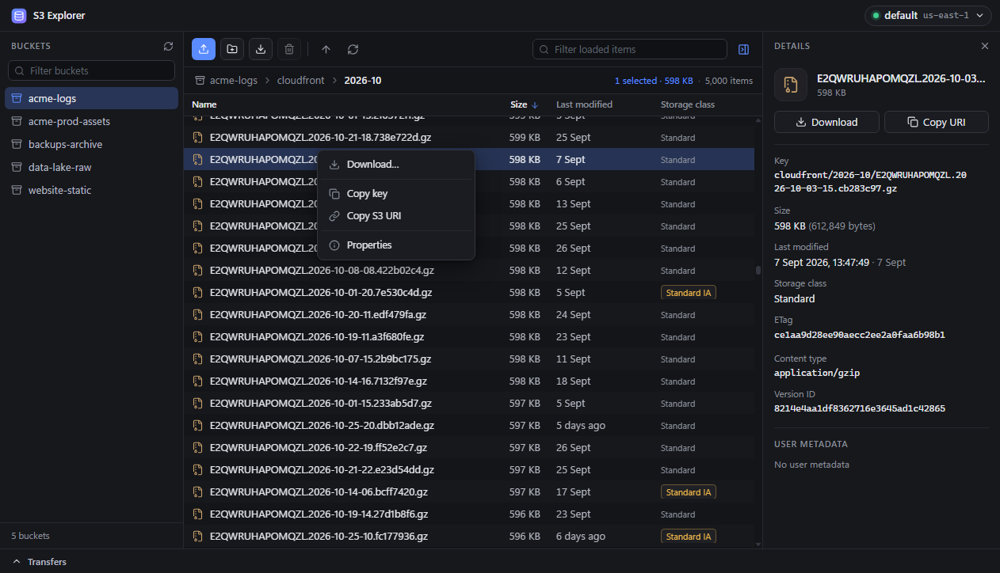
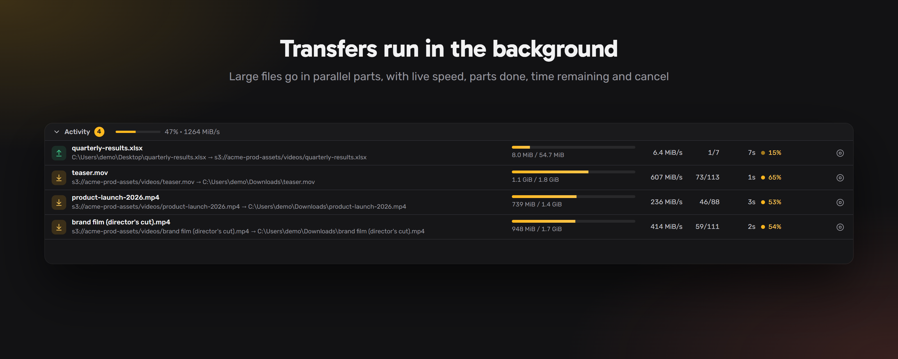

# S3 Explorer

A fast desktop file browser for Amazon S3 and S3-compatible storage. One small native executable, no Electron, no subscription.



## Why this exists

I didn't want to pay for an S3 explorer tool. So I vibe coded one. :)

**This project is vibe coded.** I described what I wanted and AI agents wrote essentially all of it: the Rust backend, the React UI, the tests, the build pipeline, and yes, most of this README. I steered, reviewed the results and said "also add that". If that makes you nervous about pointing it at a production bucket, good. Read [Should you trust it?](#should-you-trust-it) before you do.

## What it does

- **Connect** with an AWS profile from `~/.aws`, or with access keys. A custom endpoint makes it work with MinIO, Cloudflare R2, SeaweedFS, LocalStack and friends.
- **List buckets**, including buckets in other regions.
- **Browse folders and objects** in a virtualized table that stays smooth with thousands of rows. Size, last modified, storage class, ETag, content type and user metadata are all there.
- **Download in parallel parts.** Large objects are split into byte ranges and fetched over several connections at once.
- **Upload** with multipart for large files, by button or by dragging files onto the window.
- **Create folders** and **delete folders** recursively.
- **Transfers panel** with live speed, parts, ETA, cancel, and "show in folder".
- Dark and light themes that follow your system.



### What it does not do (yet)

Deleting or renaming a single object, copy and move, creating or deleting buckets, versioning, presigned URLs, permissions, sync. It was scoped small on purpose.

## How downloads are split

| Object size | Part size | How it downloads |
|---|---|---|
| 8 MiB or less | not split | one ordinary GET |
| over 8 MiB, up to 1 GiB | 8 MiB | parallel ranged GETs |
| over 1 GiB | 16 MiB | parallel ranged GETs |

Up to 8 parts of a file are in flight at once, and up to 4 transfers run at the same time. Each part is written straight to its offset in a pre-sized temp file, which is renamed when the last part lands. Every request carries the object's ETag, so a file that changes mid-download fails instead of being stitched together from two versions. Failed parts are retried.

## Get it

**Download a build.** Every version is built for Windows, macOS (Apple Silicon and Intel) and Linux by GitHub Actions. Grab the file for your system from the [Releases page](../../releases): either the bare executable or an installer. Each release comes with patch notes.

**Or build it yourself.** You need [Node.js](https://nodejs.org) 22+, [Rust](https://rustup.rs) (the exact toolchain is pinned in `src-tauri/rust-toolchain.toml` and installs itself), and the [Tauri prerequisites](https://tauri.app/start/prerequisites/) for your OS.

```bash
git clone https://github.com/yonatand/S3Explorer.git
cd S3Explorer
npm install
npm run tauri build
```

The executable lands in `src-tauri/target/release/`, with installers under `src-tauri/target/release/bundle/`.

## Should you trust it?

Honest status, as of `v0.1.0`:

| | |
|---|---|
| Tested end to end on Windows against a local S3 server | yes |
| Unit tests, lint, and an integration smoke test with checksum verification | yes |
| Independent AI code review, with every finding fixed | yes |
| Tested against real AWS S3 | **not yet** |
| macOS and Linux builds actually run by a human | **not yet** |
| Reviewed line by line by a human | **no** |

Some things were done carefully because this tool can delete data and write to your disk:

- Your secret key is never written to disk by the app. Only the profile name, region, endpoint and access key id are remembered.
- Folder deletion sends exactly the prefix shown in the confirmation dialog, byte for byte.
- File names coming from S3 are sanitized before they become local paths, so a hostile key can't write outside the folder you picked.
- The webview runs under a restrictive content security policy and all S3 traffic goes through the Rust side.

Still: it is young, AI-written software. Try it on a bucket you can afford to lose before trusting it with one you can't, and prefer credentials that only have the permissions you need.

## How it's built

- **[Tauri v2](https://tauri.app)** shell: the UI runs in the operating system's own webview, which is why the Windows executable is about 14 MB.
- **Rust** backend using the official AWS SDK and tokio. Transfers run entirely on this side.
- **React + TypeScript + Vite** frontend with a virtualized table.

The two halves talk through a small set of commands and one progress event, all written down in [docs/CONTRACT.md](docs/CONTRACT.md).

### Developing

```bash
npm run dev          # UI only, in a browser, against a built-in mock (no Rust build needed)
npm run tauri dev    # the real desktop app with hot reload
```

```bash
cd src-tauri
cargo clippy --all-targets
cargo test
cargo run --example smoke   # end-to-end test against a local S3-compatible server
```

`npm run build` type-checks and bundles the frontend.

### How the vibe coding actually worked

One AI session acted as orchestrator. It picked the stack, wrote the contract between backend and frontend, then handed the two halves to separate agents that built them in parallel. A third agent drove the real executable end to end against a local S3 server, and a fourth did a read-only code review whose findings were fixed before the first tag.

The rules and playbooks the agents follow are checked in under [.claude/](.claude/), if you're curious what steering an AI-built project looks like in practice.

## Versioning

Releases are tagged `vMAJOR.MINOR.PATCH`. Pushing a tag builds the executables for all three platforms and publishes a release with the patch notes from [CHANGELOG.md](CHANGELOG.md).
